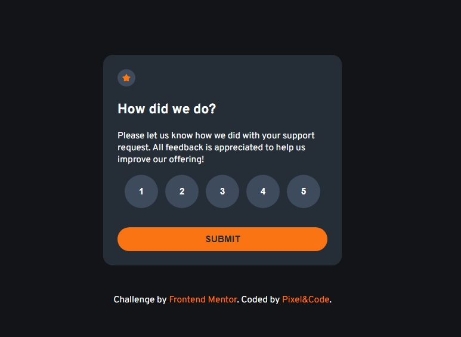
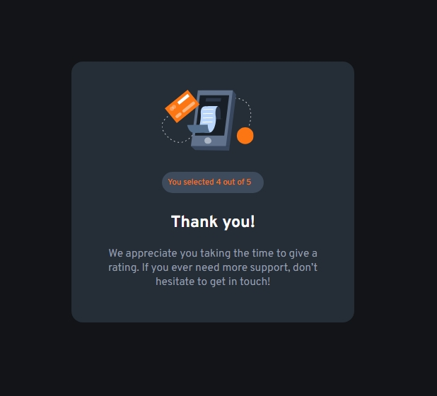

# Frontend Mentor - Interactive rating component solution

This is a solution to the [Interactive rating component challenge on Frontend Mentor](https://www.frontendmentor.io/challenges/interactive-rating-component-koxpeBUmI). Frontend Mentor challenges help you improve your coding skills by building realistic projects. 

## Table of contents

- [Overview](#overview)
  - [The challenge](#the-challenge)
  - [Screenshot](#screenshot)
  - [Links](#links)
- [My process](#my-process)
  - [Built with](#built-with)
  - [What I learned](#what-i-learned)
  - [Continued development](#continued-development)
  - [Useful resources](#useful-resources)
- [Author](#author)
- [Acknowledgments](#acknowledgments)


## Overview

In this project, I built an interactive rating component that allows a user to select a score from 1 to 5 and then submit it. After submission, they are redirected to a "Thank You" page where their selected rating is displayed.

### The challenge

1️⃣ Attaching event listeners to multiple buttons and getting their values:

- Solved by looping over ```querySelectorAll(".rating-btn button")``` and using ```index + 1``` as the score.

2️⃣ Handling shared JavaScript across multiple HTML files:

- Because both HTML files used the same ```index.js``` script, I had to ensure elements exist before attaching listeners to avoid null errors (e.g., checking if ```ratingBtns.length``` and ```submitBtn``` exist).
### Screenshot





### Links

- Solution URL: [Add solution URL here](https://your-solution-url.com)
- Live Site URL: [Add live site URL here](https://your-live-site-url.com)

## My process

1️⃣ Design & structure:

Created two HTML pages:

Main rating page, with buttons for each score and a submit button.

Thank you page, to show the selected score.

2️⃣ Event handling:

Added event listeners to each rating button to capture which button was clicked.

Stored the selected score in a variable.

3️⃣ Data persistence & redirect:

Used localStorage to store the selected score temporarily.

On submit, redirected to the "Thank You" page using window.location.href.

4️⃣ Display selected score on new page:

- Retrieved the score from localStorage on the "Thank You" page.

- Rendered it inside a ``<p>`` element with class .rating-info.

- Removed the score from localStorage after use.

### Built with

- HTML: Page structure & semantic markup.

- CSS: Styling & responsive design (custom colors, hover states, layout).

- JavaScript: DOM manipulation, event handling, localStorage for data sharing between pages.


### What I learned

- How to dynamically attach event listeners to multiple buttons and identify which was clicked.

- How to share data between different pages using localStorage.

- The importance of checking element existence when using the same JS file on multiple pages to prevent errors.

- How to handle redirects with ```window.location.href.```

To see how you can add code snippets, see below:

```html
<h1>Some HTML code I'm proud of</h1>
```
```css
.proud-of-this-css {
  color: papayawhip;
}
```
```js
const proudOfThisFunc = () => {
  console.log('🎉')
}
```


### Continued development

Use this section to outline areas that you want to continue focusing on in future projects. These could be concepts you're still not completely comfortable with or techniques you found useful that you want to refine and perfect.


### Useful resources

- [How to get value of button clicked in JavaScript](https://www.kodeclik.com/how-to-get-value-of-button-clicked-in-javascript/) — kodeclik: Helped me understand multiple ways to get button values.

- [YouTube — Get value of the clicked button in JavaScript:](https://www.youtube.com/watch?v=sTjMaVUtoFk) Practical examples on event handling.

- [YouTube — How to redirect to another page in JavaScript:](https://www.youtube.com/watch?v=Ffw_CFyieTs) Helped with implementing the redirect after submitting the rating.


## Author

- Frontend Mentor - [@jeff20501](https://www.frontendmentor.io/profile/jeff20501)
- github - [@jeff20501](https://github.com/jeff20501)

## Acknowledgments

This is where you can give a hat tip to anyone who helped you out on this project. Perhaps you worked in a team or got some inspiration from someone else's solution. This is the perfect place to give them some credit.

**Note: Delete this note and edit this section's content as necessary. If you completed this challenge by yourself, feel free to delete this section entirely.**
